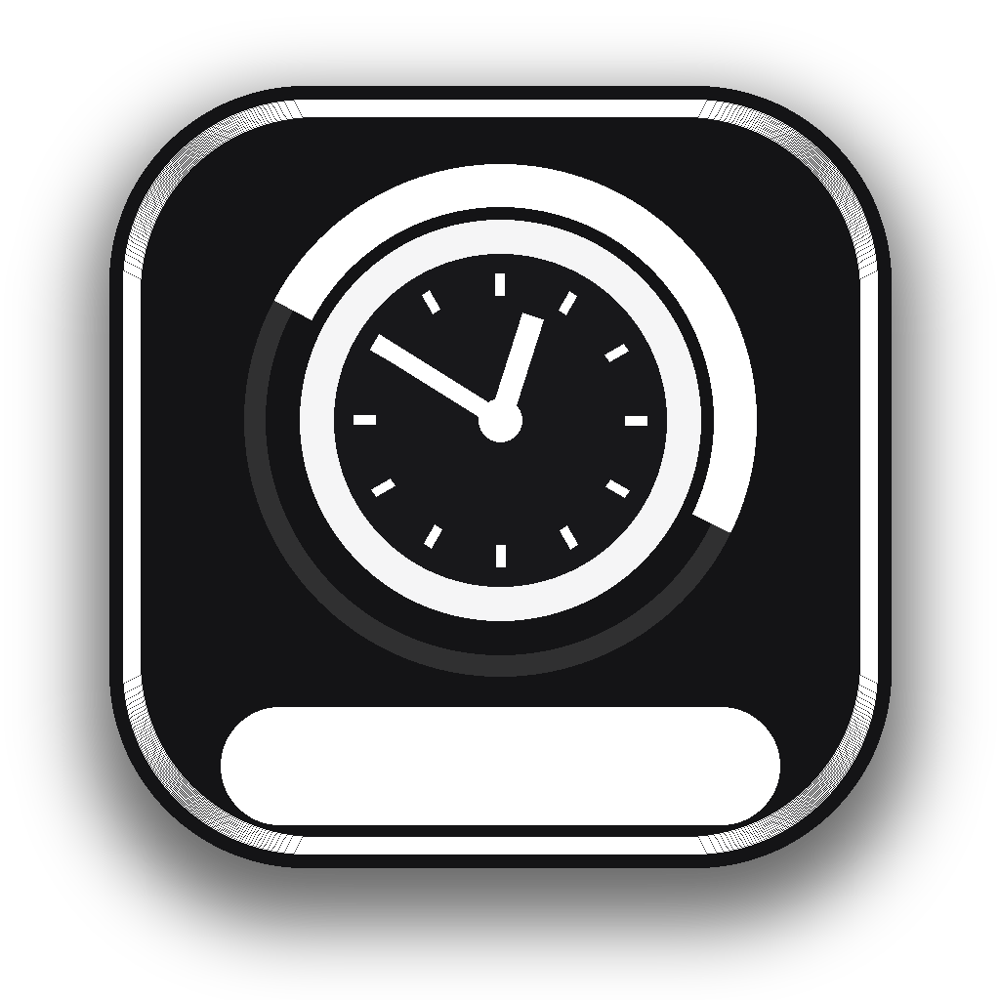

# WorkTimer

<p align="center">
  
</p>

<p align="center">
  WorkTimer is a native macOS menu bar timer for tracking work time, live pay, typing, mouse movement, and daily history from the top-right of your screen.
</p>

<p align="center">
  
  
  
  
</p>

<p align="center">
  <a href="#overview">Overview</a> ·
  <a href="#features">Features</a> ·
  <a href="#quick-start">Quick Start</a> ·
  <a href="#permissions">Permissions</a> ·
  <a href="#share-the-app">Share The App</a> ·
  <a href="#development">Development</a>
</p>

## Overview

WorkTimer launches into the macOS menu bar and starts counting immediately. It is built for people who want a simple timer at the top of the screen, but also want richer local stats without needing a web account or sync service.

It can show different live values in the menu bar, including:

- elapsed work time
- earnings
- typing time
- CPM / WPM / chars
- mouse travel
- AI usage
- disk stats
- icon-only mode

The panel gives you quick controls, live stats, daily history, and a detail window for past days.

## Features

| Area | What it does |
| --- | --- |
| Timer | Starts on launch, pauses/resumes with one click, resets daily automatically |
| Menu bar | Single click toggles, double click opens panel, right click opens panel |
| Pay | Hourly rate input plus live earnings that move smoothly |
| Typing | Tracks typing time, characters, CPM, WPM, with short idle gaps handled gracefully |
| Mouse | Tracks estimated on-screen cursor travel and movement time |
| Daily log | Saves each day locally and opens a full detail panel when you click a day |
| Persistence | Restores the current day after relaunch instead of wiping the timer |
| Local data | Uses local SQLite storage in `~/Library/Application Support/WorkTimer` |
| Extras | Wispr Flow stats, AI usage stats, disk counters, launch-at-login setup |

## Quick Start

If you are just downloading `WorkTimer.app` or `WorkTimer-macOS.zip`:

1. Unzip it.
2. Drag `WorkTimer.app` into `/Applications` or `~/Applications`.
3. Open it.
4. The setup panel should appear automatically on first launch.
5. If the menu bar item is hidden, check Ice or Bartender’s hidden section first.

What you should see:

- a menu bar item at the top-right of the screen
- a setup/control panel on first launch
- the app in the Dock while it is running

## Permissions

Timer and pay tracking work immediately.

Typing and mouse stats need macOS privacy approval:

- `System Settings > Privacy & Security > Accessibility`
- `System Settings > Privacy & Security > Input Monitoring`

Important:

- move `WorkTimer.app` into `/Applications` or `~/Applications` before granting permissions
- the app retries automatically after permissions are enabled
- if the stats still look stuck, relaunch the app once

Helpful commands:

```bash
./scripts/open-permissions.sh
./scripts/reset-permissions.sh
./scripts/open-app.sh
./scripts/doctor.sh
```

## Install From Source

```bash
./scripts/install-app.sh
```

That will:

- build a release app
- install it to `~/Applications/WorkTimer.app`
- sign it for local use
- reopen the app

If a personal `Developer ID Application` certificate is available in Keychain, the installer uses it. Otherwise it falls back to ad hoc signing for local use.

## Share The App

To make a sendable zip:

```bash
./scripts/package-app.sh
```

That creates:

- `dist/WorkTimer-macOS.zip`
- `dist/README-SEND-TO-FRIENDS.txt`

For a notarized zip:

```bash
./scripts/package-app.sh --notarize --profile=Personal
```

## First-Run Behavior

On a normal first run:

- the app appears in the menu bar
- the setup panel opens automatically
- launch-at-login is requested
- the timer starts immediately

Controls:

- single click: pause or resume
- double click: open panel
- right click: open panel

## Local Storage

WorkTimer stores its data locally:

- main DB: `~/Library/Application Support/WorkTimer/worktimer.sqlite`
- app bundle install target: `~/Applications/WorkTimer.app`

Notes:

- current-day state survives relaunches
- daily history is saved locally
- older typing DB installs are migrated automatically
- mouse distance is an estimate of cursor travel on the display surface
- Wispr Flow stats are read from the local Wispr database when available

## Development

Run directly:

```bash
swift run WorkTimer
```

Build:

```bash
swift build
```

Test:

```bash
swift test
```

## Repository Layout

| Path | Purpose |
| --- | --- |
| `Sources/WorkTimer` | App code |
| `Tests/WorkTimerTests` | Unit and behavior tests |
| `scripts/install-app.sh` | Build + install locally |
| `scripts/package-app.sh` | Build a sendable zip |
| `scripts/open-app.sh` | Reopen the installed app |
| `scripts/open-permissions.sh` | Jump to relevant macOS privacy panes |
| `scripts/doctor.sh` | Inspect install path, trust, and setup state |

## Requirements

- macOS 14 or newer
- Xcode 16 or a current Swift 6 toolchain
